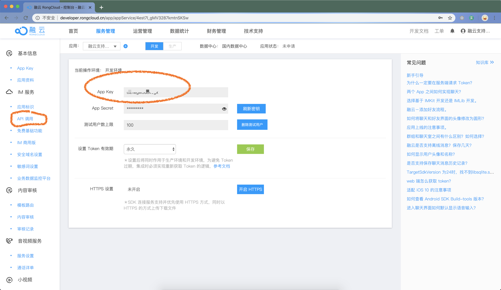

# imkit-vue

方便 Vue 开发者，快速集成 IMKit, 只需要专注实现自己的业务信息接口即可。

### 工程命令

```bash
# 安装
npm install

# 开发
npm run dev

# 生产
npm run build
```

### 集成步骤

#### 准备 AppKey 和 用户 Token

便于前端开发人员快速集成开发，暂时不需要客户服务器向融云服务器发起请求。通过融云开发者后台提供的 API 回调接口功能，快捷的获取开发测试数据、消息联调等。



```javascript
// main.js

// ⚠️ 注意替换为自己的AppKey （以下是测试appkey）⚠️
const APPKEY = "";

// ⚠️ 注意替换为当前用户的真实Token（以下是测试token）⚠️
const TOKEN =
  "";

// done
```

### 业务集成

### 因为融云不保存客户的敏感信息，好友关系，群组关系，等这些客户重要业务消息。IMKit 界面需要展示这些信息时，框架自动调用这些预留的扩展接口。所以客户需要实现这些预留的接口，用于界面展示。

#### 用户资料/群组资料接口

```javascript
// 扩展文件
`src/custom_service.js`

// 获取用户资料
getUserProfile(userId) {
// 根据 userId，获取用户资料，异步处理 Promise
// ...
// 返回数据格式
  return {
    id: userId,
    name: "用户昵称",
    portraitUri: "用户头像地址"
  }
}

getConversationProfile(conversations) {
  // 根据 targetId / conversationType 获取会话资料，异步处理 Promise
  // ...
  // 返回数据格式
  return [{
    targetId: "会话Id",
    conversationType: "会话类型",
    channelId: "会话频道",
    name: "会话昵称",
    portraitUri: "会话头像地址"
  }, {
      targetId: "会话Id",
      conversationType: "会话类型",
      channelId: "会话频道",
      name: "会话昵称",
      portraitUri: "会话头像地址"
  }
  ...
  ]
}

```
